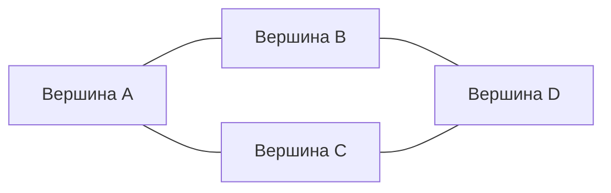

# Основные структуры данных в Python и сложность операций Big O

## 1. Что такое Big O

**Big O** — это способ описать, как растёт время выполнения алгоритма или операции при увеличении размера входных данных.

Обычно размер данных обозначают как `n`.

| Сложность | Что означает | Примерный смысл |
|---|---|---|
| `O(1)` | константное время | операция выполняется почти одинаково быстро при любом размере данных |
| `O(log n)` | логарифмическое время | данные уменьшаются примерно в несколько раз на каждом шаге |
| `O(n)` | линейное время | нужно пройти по всем элементам |
| `O(n log n)` | квазилинейное время | часто встречается в эффективных сортировках |
| `O(n^2)` | квадратичное время | вложенные циклы по одним и тем же данным |

---

# 2. `list` — список

**Список** — это изменяемая упорядоченная структура данных.

```python
numbers = [10, 20, 30, 40]
```

К элементам можно обращаться по индексу:

```python
numbers[0]  # 10
numbers[2]  # 30
```

## Принцип работы

`list` в Python реализован как **динамический массив**.

Это значит, что элементы хранятся в порядке, а Python может быстро получить элемент по индексу. Например, доступ к `numbers[2]` работает быстро, потому что Python сразу вычисляет, где находится третий элемент.

Но если вставить элемент в начало или середину списка, остальные элементы нужно сдвигать. Поэтому такие операции медленнее.

```python
numbers.insert(0, 5)
```

## Сложность операций `list`

| Операция | Пример | Сложность |
|---|---|---|
| Доступ по индексу | `lst[i]` | `O(1)` |
| Изменение по индексу | `lst[i] = x` | `O(1)` |
| Добавление в конец | `lst.append(x)` | `O(1)` в среднем |
| Удаление с конца | `lst.pop()` | `O(1)` |
| Вставка в начало/середину | `lst.insert(i, x)` | `O(n)` |
| Удаление из начала/середины | `lst.pop(i)` | `O(n)` |
| Поиск элемента | `x in lst` | `O(n)` |
| Длина списка | `len(lst)` | `O(1)` |
| Сортировка | `lst.sort()` | `O(n log n)` |

`append()` работает за `O(1)` **в среднем**, потому что иногда Python расширяет внутренний массив и переносит элементы в новое место памяти. Такая сложность называется **амортизированной**.

## Когда использовать

Список удобно использовать, когда:

- важен порядок элементов;
- нужен быстрый доступ по индексу;
- нужно часто добавлять элементы в конец.

---

# 3. `tuple` — кортеж

**Кортеж** похож на список, но его нельзя изменять после создания.

```python
point = (10, 20)
```

Можно читать элементы:

```python
point[0]  # 10
```

Но нельзя изменить:

```python
point[0] = 15  # ошибка
```

## Принцип работы

Кортеж — это фиксированная последовательность элементов. Он неизменяемый, поэтому его удобно использовать для хранения данных, которые не должны случайно поменяться.

Например, координаты точки:

```python
coordinate = (59.93, 30.31)
```

Кортеж можно использовать как ключ словаря, если внутри него лежат только неизменяемые объекты:

```python
locations = {
    (10, 20): "точка A",
    (30, 40): "точка B"
}
```

## Сложность операций `tuple`

| Операция | Пример | Сложность |
|---|---|---|
| Доступ по индексу | `t[i]` | `O(1)` |
| Поиск элемента | `x in t` | `O(n)` |
| Длина | `len(t)` | `O(1)` |
| Создание кортежа из списка | `tuple(lst)` | `O(n)` |
| Срез | `t[a:b]` | `O(k)` |

`k` — количество элементов в срезе.

## Когда использовать

Кортеж удобно использовать, когда:

- данные не должны изменяться;
- нужно хранить фиксированный набор значений;
- нужно использовать последовательность как ключ в словаре.

---

# 4. `dict` — словарь

**Словарь** хранит данные в формате:

```python
ключ: значение
```

Пример:

```python
student = {
    "name": "Никита",
    "age": 22,
    "group": "R3336"
}
```

Получение значения по ключу:

```python
student["name"]  # "Никита"
```

Добавление нового значения:

```python
student["city"] = "Санкт-Петербург"
```

## Принцип работы

Словарь работает на основе **хеш-таблицы**.

У каждого ключа Python вычисляет специальное число — **хеш**. По этому хешу Python быстро находит место, где лежит значение.

Поэтому доступ по ключу обычно очень быстрый.

```python
student["age"]
```

## Сложность операций `dict`

| Операция | Пример | Сложность в среднем | Худший случай |
|---|---|---|---|
| Получение значения | `d[key]` | `O(1)` | `O(n)` |
| Добавление пары | `d[key] = value` | `O(1)` | `O(n)` |
| Изменение значения | `d[key] = new_value` | `O(1)` | `O(n)` |
| Удаление ключа | `del d[key]` | `O(1)` | `O(n)` |
| Проверка ключа | `key in d` | `O(1)` | `O(n)` |
| Перебор всех элементов | `for k in d` | `O(n)` | `O(n)` |
| Длина | `len(d)` | `O(1)` | `O(1)` |

Худший случай `O(n)` возникает редко, например при большом количестве хеш-коллизий.

## Когда использовать

Словарь удобно использовать, когда:

- нужно быстро искать значение по ключу;
- нужно хранить пары «ключ — значение»;
- нужно описывать объекты с набором свойств.

Пример:

```python
prices = {
    "яблоко": 100,
    "банан": 80,
    "апельсин": 120
}
```

---

# 5. `set` — множество

**Множество** хранит только уникальные элементы.

```python
numbers = {1, 2, 3, 3, 4}
print(numbers)
```

Результат:

```python
{1, 2, 3, 4}
```

Повторяющееся значение осталось только один раз.

## Принцип работы

`set`, как и `dict`, работает на основе **хеш-таблицы**.

Разница в том, что `dict` хранит пары «ключ — значение», а `set` хранит только сами элементы.

Проверка наличия элемента работает быстро:

```python
if 3 in numbers:
    print("Есть")
```

## Сложность операций `set`

| Операция | Пример | Сложность в среднем | Худший случай |
|---|---|---|---|
| Добавление | `s.add(x)` | `O(1)` | `O(n)` |
| Удаление | `s.remove(x)` | `O(1)` | `O(n)` |
| Проверка наличия | `x in s` | `O(1)` | `O(n)` |
| Длина | `len(s)` | `O(1)` | `O(1)` |
| Перебор элементов | `for x in s` | `O(n)` | `O(n)` |

## Операции множеств

```python
a = {1, 2, 3}
b = {3, 4, 5}
```

| Операция | Пример | Результат | Сложность |
|---|---|---|---|
| Объединение | `a | b` | `{1, 2, 3, 4, 5}` | `O(len(a) + len(b))` |
| Пересечение | `a & b` | `{3}` | `O(min(len(a), len(b)))` в среднем |
| Разность | `a - b` | `{1, 2}` | `O(len(a))` |

> В коде Python для объединения используется оператор `|`.

## Когда использовать

Множество удобно использовать, когда:

- нужно убрать повторяющиеся элементы;
- нужно быстро проверить наличие элемента;
- нужны операции объединения, пересечения и разности.

---


# 6. Хеш, хеш-таблица и коллизии

Этот раздел нужен, чтобы лучше понять, почему `dict` и `set` в Python обычно работают очень быстро.

И `dict`, и `set` основаны на **хеш-таблице**.

- `dict` хранит пары `ключ -> значение`;
- `set` хранит только уникальные элементы;
- оба используют хеши для быстрого поиска.

---

## Что такое хеш

**Хеш** — это целое число, которое Python вычисляет по объекту.

Для этого используется функция `hash()`:

```python
hash("name")
hash(42)
hash((1, 2))
```

Упрощённо:

```text
"name" -> hash("name") -> большое целое число
```

Например, условно:

```text
"name" -> 872349
"age"  -> 129045
"city" -> 551982
```

Это число используется, чтобы быстро определить место объекта во внутренней таблице.

Важно: **хеш — это не сам объект**. Это только число, вычисленное по объекту.

---

## Что такое хеш-таблица

**Хеш-таблица** — это структура данных, где место хранения элемента выбирается с помощью хеша.

Упрощённая схема:

```text
ключ -> hash(ключ) -> индекс в таблице -> ячейка
```

Например, есть словарь:

```python
student = {
    "name": "Никита",
    "age": 22
}
```

Внутри словаря можно представить это примерно так:

```text
ячейка 0: пусто
ячейка 1: hash("age"),  "age",  22
ячейка 2: пусто
ячейка 3: hash("name"), "name", "Никита"
```

То есть в случае `dict` хеш-таблица хранит не только значение, а связку:

```text
хеш ключа + ключ + значение
```

Ключ тоже хранится, потому что по нему нужно проверить, что Python нашёл именно нужный элемент, а не другой элемент с похожим хешем или той же ячейкой.

У `set` похожий принцип, но значения нет:

```text
хеш элемента + элемент
```

---

## Почему ключи словаря должны быть хешируемыми

Ключ словаря должен быть **хешируемым**.

Хешируемый объект — это объект, у которого есть стабильный хеш и который можно сравнивать с другими объектами.

Можно использовать как ключи:

```python
d = {
    "name": "Никита",
    10: "число",
    (1, 2): "точка"
}
```

Нельзя использовать изменяемые объекты:

```python
d = {
    [1, 2]: "значение"
}
```

Будет ошибка:

```text
TypeError: unhashable type: 'list'
```

Список нельзя использовать как ключ, потому что его можно изменить:

```python
lst = [1, 2]
lst.append(3)
```

Если бы список был ключом, его хеш мог бы измениться. Тогда словарь положил бы ключ в одно место, а после изменения начал бы искать его уже в другом месте.

Поэтому ключи должны быть неизменяемыми или хотя бы вести себя как неизменяемые.

| Тип | Можно использовать как ключ `dict`? | Причина |
|---|---|---|
| `int` | да | неизменяемый и хешируемый |
| `float` | да | неизменяемый и хешируемый |
| `str` | да | неизменяемая строка |
| `tuple` | да, если внутри хешируемые элементы | сам кортеж неизменяемый |
| `list` | нет | изменяемый |
| `dict` | нет | изменяемый |
| `set` | нет | изменяемый |

---

## Главное правило хеша

Если два объекта равны, их хеши должны быть одинаковыми.

```python
a = "hello"
b = "hello"

print(a == b)              # True
print(hash(a) == hash(b))  # True
```

Но обратное не обязательно верно:

```text
одинаковый хеш не всегда означает одинаковые объекты
```

Именно поэтому Python после нахождения ячейки дополнительно сравнивает ключи через `==`.

---

## Что такое коллизия

**Коллизия** — это ситуация, когда разные ключи попадают в одну и ту же ячейку хеш-таблицы.

Например, условно:

```text
hash("cat") % 8 = 3
hash("dog") % 8 = 3
```

Ключи разные, но оба хотят попасть в ячейку `3`.

Такое возможно потому, что:

- возможных объектов очень много;
- возможных хешей тоже много;
- но размер таблицы ограничен.

Поэтому разные ключи иногда попадают в одну область таблицы.

---

## Как Python решает коллизии

Есть разные способы решать коллизии. Один известный способ — **метод цепочек**, когда в одной ячейке хранится список элементов.

Упрощённо:

```text
ячейка 3: [("cat", 10), ("dog", 20)]
```

Но словари Python используют другой подход — **открытую адресацию**.

Смысл открытой адресации:

```text
если нужная ячейка занята,
Python ищет другую подходящую ячейку по специальному правилу
```

Упрощённый пример:

```text
хотели положить "dog" в ячейку 3
ячейка 3 уже занята ключом "cat"
Python проверяет другую ячейку
находит свободную
кладёт "dog" туда
```

То есть элемент может храниться не строго в первой рассчитанной ячейке, а в другой ячейке, найденной алгоритмом поиска.

---

## Как Python понимает, что нашёл правильный ключ

Python не доверяет только хешу.

При поиске значения:

```python
student["name"]
```

Python делает примерно следующее:

```text
1. Считает hash("name")
2. По хешу находит предполагаемую ячейку
3. Смотрит, что там лежит
4. Сравнивает найденный ключ с искомым через ==
5. Если ключ совпал — возвращает значение
6. Если не совпал — продолжает поиск дальше
```

Именно поэтому в `dict` хранится сам ключ, а не только значение.

---

## Что будет, если записать значение по тому же ключу

Это не коллизия:

```python
d = {}

d["name"] = "Никита"
d["name"] = "Иван"
```

Здесь ключ один и тот же — `"name"`.

Поэтому словарь просто обновит значение:

```text
было:  "name" -> "Никита"
стало: "name" -> "Иван"
```

Коллизия — это когда **разные ключи** претендуют на одну и ту же ячейку.

---

## Что происходит при удалении элемента

При удалении элемента из хеш-таблицы нельзя всегда просто сделать ячейку пустой.

Причина: из-за коллизий некоторые элементы могли быть размещены дальше по цепочке поиска.

Поэтому в хеш-таблицах часто используется специальная метка вроде:

```text
удалено
```

Упрощённо:

```text
ячейка 0: пусто
ячейка 1: "cat"
ячейка 2: удалено
ячейка 3: "dog"
```

Метка `удалено` означает:

```text
здесь раньше что-то было, поэтому поиск нельзя останавливать
```

Иначе Python мог бы слишком рано решить, что нужного ключа нет.

Позже, когда таблица перестраивается или расширяется, такие служебные метки очищаются.

---

## Что происходит, когда словарь или множество растёт

Если элементов становится слишком много, свободных ячеек становится меньше, а коллизий становится больше.

Тогда Python увеличивает внутреннюю таблицу.

Условно:

```text
было:  8 ячеек
стало: 16 ячеек
```

После расширения элементы перераспределяются по новой таблице.

Это может занять `O(n)`, потому что нужно пройти по элементам и разложить их заново.

Но расширение происходит не при каждом добавлении, поэтому добавление в `dict` и `set` считается:

```text
O(1) в среднем
```

Или точнее:

```text
O(1) амортизированно
```

---

## Сложность операций с учётом коллизий

| Структура | Операция | Средняя сложность | Худший случай |
|---|---|---|---|
| `dict` | поиск по ключу `d[key]` | `O(1)` | `O(n)` |
| `dict` | добавление `d[key] = value` | `O(1)` | `O(n)` |
| `dict` | удаление `del d[key]` | `O(1)` | `O(n)` |
| `dict` | проверка `key in d` | `O(1)` | `O(n)` |
| `set` | добавление `s.add(x)` | `O(1)` | `O(n)` |
| `set` | удаление `s.remove(x)` | `O(1)` | `O(n)` |
| `set` | проверка `x in s` | `O(1)` | `O(n)` |

Худший случай `O(n)` возникает, если много элементов конфликтуют между собой и Python вынужден проверять много ячеек.

На практике `dict` и `set` в Python работают очень быстро, потому что хеш-таблицы автоматически расширяются и хорошо распределяют элементы.

---

## Искусственный пример коллизии

Можно специально создать объекты, у которых всегда одинаковый хеш:

```python
class BadHash:
    def __init__(self, value):
        self.value = value

    def __hash__(self):
        return 1

    def __eq__(self, other):
        return self.value == other.value


a = BadHash("a")
b = BadHash("b")

d = {
    a: "первое значение",
    b: "второе значение"
}
```

У `a` и `b` одинаковый хеш:

```python
hash(a)  # 1
hash(b)  # 1
```

Но это разные ключи, потому что:

```python
a == b  # False
```

Python сможет хранить оба объекта в словаре, но при большом количестве таких ключей работа словаря станет медленнее.

---

## Коротко про `dict` и `set`

`dict` хранит:

```text
хеш + ключ + значение
```

`set` хранит:

```text
хеш + элемент
```

Хеш нужен, чтобы быстро найти место в таблице.

Ключ или элемент нужен, чтобы проверить совпадение через `==`.

Коллизия возникает, когда разные ключи попадают в одну область таблицы.

Python решает коллизии с помощью открытой адресации: если одна ячейка занята, ищется другая подходящая ячейка.

# 7. `str` — строка

**Строка** хранит текст.

```python
text = "hello"
```

Строки в Python неизменяемые.

```python
text[0] = "H"  # ошибка
```

Чтобы изменить строку, создаётся новая строка:

```python
text = "H" + text[1:]
```

## Принцип работы

Строка — это неизменяемая последовательность символов.

Можно читать символы по индексу:

```python
text[0]  # 'h'
```

Но нельзя изменить отдельный символ напрямую.

## Сложность операций `str`

| Операция | Пример | Сложность |
|---|---|---|
| Доступ по индексу | `s[i]` | `O(1)` |
| Длина | `len(s)` | `O(1)` |
| Поиск символа/подстроки | `"a" in s` | `O(n)` |
| Срез | `s[a:b]` | `O(k)` |
| Склеивание строк | `s1 + s2` | `O(len(s1) + len(s2))` |
| Разделение | `s.split()` | `O(n)` |
| Замена | `s.replace(a, b)` | `O(n)` |

`k` — длина получившегося среза.

## Важный момент про строки

Плохо склеивать много строк через `+` в цикле:

```python
result = ""

for word in words:
    result += word
```

Лучше использовать `join()`:

```python
result = "".join(words)
```

Так работает быстрее, потому что итоговая строка собирается более эффективно.

---

# 8. `deque` — двусторонняя очередь

`deque` находится в модуле `collections`.

```python
from collections import deque

queue = deque()
queue.append("первый")
queue.append("второй")
```

Удаление из начала:

```python
queue.popleft()  # "первый"
```

## Принцип работы

`deque` оптимизирован для быстрого добавления и удаления элементов с двух сторон.

Обычный список плохо подходит для удаления из начала:

```python
lst.pop(0)
```

После удаления первого элемента остальные элементы списка нужно сдвигать.

А у `deque` удаление из начала работает быстро:

```python
queue.popleft()
```

## Сложность операций `deque`

| Операция | Пример | Сложность |
|---|---|---|
| Добавить справа | `dq.append(x)` | `O(1)` |
| Добавить слева | `dq.appendleft(x)` | `O(1)` |
| Удалить справа | `dq.pop()` | `O(1)` |
| Удалить слева | `dq.popleft()` | `O(1)` |
| Доступ по индексу | `dq[i]` | `O(n)` |
| Поиск элемента | `x in dq` | `O(n)` |
| Длина | `len(dq)` | `O(1)` |

## Когда использовать

`deque` удобно использовать, когда:

- нужна очередь;
- нужно часто добавлять или удалять элементы с начала;
- нужно быстро работать с обоими концами структуры.

---

# 9. `heapq` — куча / приоритетная очередь

`heapq` — это модуль для работы с кучей.

```python
import heapq

heap = []

heapq.heappush(heap, 5)
heapq.heappush(heap, 2)
heapq.heappush(heap, 8)
```

Извлечение минимального элемента:

```python
heapq.heappop(heap)  # 2
```

## Принцип работы

Куча — это структура данных, в которой минимальный элемент всегда находится наверху.

В Python `heapq` реализует **минимальную кучу**.

Главная идея: можно быстро получать самый маленький элемент, не сортируя весь список каждый раз.

## Сложность операций `heapq`

| Операция | Пример | Сложность |
|---|---|---|
| Добавить элемент | `heapq.heappush(heap, x)` | `O(log n)` |
| Извлечь минимум | `heapq.heappop(heap)` | `O(log n)` |
| Посмотреть минимум | `heap[0]` | `O(1)` |
| Превратить список в кучу | `heapq.heapify(lst)` | `O(n)` |
| Найти `k` наименьших | `heapq.nsmallest(k, data)` | примерно `O(n log k)` |

## Пример приоритетной очереди

```python
import heapq

tasks = []

heapq.heappush(tasks, (2, "обычная задача"))
heapq.heappush(tasks, (1, "срочная задача"))
heapq.heappush(tasks, (5, "несрочная задача"))

heapq.heappop(tasks)
```

Результат:

```python
(1, "срочная задача")
```

Первым выходит элемент с минимальным приоритетом.

---

# 10. `array` — массив однотипных данных

Массив из модуля `array` хранит данные одного типа.

```python
from array import array

numbers = array("i", [1, 2, 3, 4])
```

`"i"` означает целые числа.

## Принцип работы

Обычный список может хранить разные типы:

```python
data = [1, "hello", 3.14]
```

А `array` хранит только один тип данных. Из-за этого он может занимать меньше памяти.

## Сложность операций `array`

По принципу работы `array` похож на список.

| Операция | Пример | Сложность |
|---|---|---|
| Доступ по индексу | `arr[i]` | `O(1)` |
| Изменение по индексу | `arr[i] = x` | `O(1)` |
| Добавление в конец | `arr.append(x)` | `O(1)` в среднем |
| Удаление с конца | `arr.pop()` | `O(1)` |
| Вставка в начало/середину | `arr.insert(i, x)` | `O(n)` |
| Поиск | `x in arr` | `O(n)` |

## Когда использовать

`array` используют, когда нужно компактно хранить много однотипных чисел.

На практике для серьёзных численных расчётов чаще используют библиотеку `numpy`.

---

# 11. Стек

**Стек** — это структура данных по принципу:

> последним пришёл — первым вышел

По-английски это называется **LIFO** — Last In, First Out.

В Python стек обычно делают через список:

```python
stack = []

stack.append(1)
stack.append(2)
stack.append(3)

stack.pop()  # 3
```

## Принцип работы

Элементы добавляются в конец списка и удаляются тоже с конца.

То есть последний добавленный элемент будет извлечён первым.

## Сложность операций стека

| Операция | Пример | Сложность |
|---|---|---|
| Добавить наверх | `stack.append(x)` | `O(1)` в среднем |
| Удалить сверху | `stack.pop()` | `O(1)` |
| Посмотреть верхний элемент | `stack[-1]` | `O(1)` |

## Когда использовать

Стек используют для:

- отмены действий;
- проверки скобок;
- обхода графов в глубину;
- хранения истории операций.

---

# 12. Очередь

**Очередь** работает по принципу:

> первым пришёл — первым вышел

По-английски это называется **FIFO** — First In, First Out.

Для очереди лучше использовать `deque`:

```python
from collections import deque

queue = deque()

queue.append("первый")
queue.append("второй")

queue.popleft()  # "первый"
```

## Принцип работы

Элементы добавляются в конец очереди, а удаляются из начала.

То есть кто первый пришёл, тот первым и выходит.

## Сложность операций очереди

| Операция | Пример | Сложность |
|---|---|---|
| Добавить в конец | `queue.append(x)` | `O(1)` |
| Удалить из начала | `queue.popleft()` | `O(1)` |
| Посмотреть первый элемент | `queue[0]` | `O(1)` |

---

# 13. Граф

**Граф** — это структура данных, которая состоит из:

- **вершин**;
- **рёбер**, которые соединяют вершины.

Граф удобно использовать, когда нужно описать связи между объектами.

Примеры графов:

- города и дороги между ними;
- пользователи и дружба между ними;
- страницы сайта и ссылки между ними;
- задачи и зависимости между задачами;
- маршруты робота или карты помещений.

## Пример графа



В этом примере:

- вершины: `A`, `B`, `C`, `D`;
- рёбра: `A-B`, `A-C`, `B-D`, `C-D`.

---

## Основные виды графов

### Неориентированный граф

Связь работает в обе стороны.

Если есть ребро `A-B`, значит можно идти и из `A` в `B`, и из `B` в `A`.

```python
graph = {
    "A": ["B", "C"],
    "B": ["A", "D"],
    "C": ["A", "D"],
    "D": ["B", "C"]
}
```

### Ориентированный граф

Связь имеет направление.

Если есть ребро `A -> B`, это не значит, что есть путь обратно `B -> A`.

```python
graph = {
    "A": ["B", "C"],
    "B": ["D"],
    "C": ["D"],
    "D": []
}
```

### Взвешенный граф

У рёбер есть вес: расстояние, цена, время, вероятность и так далее.

```python
graph = {
    "A": [("B", 5), ("C", 2)],
    "B": [("D", 4)],
    "C": [("D", 7)],
    "D": []
}
```

Здесь, например, ребро `A -> B` имеет вес `5`.

---

## Способы хранения графа

Обозначения:

- `V` — количество вершин;
- `E` — количество рёбер.

### 1. Список смежности

Это самый частый способ хранения графа в Python.

```python
graph = {
    "A": ["B", "C"],
    "B": ["A", "D"],
    "C": ["A", "D"],
    "D": ["B", "C"]
}
```

Каждая вершина хранит список соседей.

#### Сложность списка смежности

| Операция | Сложность |
|---|---|
| Память | `O(V + E)` |
| Получить всех соседей вершины | `O(deg(v))` |
| Проверить наличие ребра `u-v` | `O(deg(u))` |
| Добавить ребро | `O(1)` в среднем |
| Обход BFS/DFS | `O(V + E)` |

`deg(v)` — степень вершины, то есть количество её соседей.

### 2. Матрица смежности

Граф можно хранить в виде таблицы `V x V`.

```python
#     A  B  C  D
# A   0  1  1  0
# B   1  0  0  1
# C   1  0  0  1
# D   0  1  1  0

matrix = [
    [0, 1, 1, 0],
    [1, 0, 0, 1],
    [1, 0, 0, 1],
    [0, 1, 1, 0]
]
```

Если `matrix[i][j] == 1`, значит между вершинами есть ребро.

#### Сложность матрицы смежности

| Операция | Сложность |
|---|---|
| Память | `O(V^2)` |
| Проверить наличие ребра `u-v` | `O(1)` |
| Получить всех соседей вершины | `O(V)` |
| Добавить ребро | `O(1)` |
| Обход BFS/DFS | `O(V^2)` |

Матрица смежности удобна, когда граф плотный, то есть рёбер очень много.

---

## Обход графа в ширину — BFS

**BFS** — Breadth-First Search, поиск в ширину.

Он сначала посещает ближайшие вершины, потом более дальние.

Для BFS обычно используют очередь.

```python
from collections import deque


def bfs(graph, start):
    visited = set()
    queue = deque([start])

    while queue:
        vertex = queue.popleft()

        if vertex in visited:
            continue

        visited.add(vertex)
        print(vertex)

        for neighbor in graph[vertex]:
            if neighbor not in visited:
                queue.append(neighbor)
```

### Сложность BFS

| Представление графа | Сложность |
|---|---|
| Список смежности | `O(V + E)` |
| Матрица смежности | `O(V^2)` |

BFS используют, например, для поиска кратчайшего пути в невзвешенном графе.

---

## Обход графа в глубину — DFS

**DFS** — Depth-First Search, поиск в глубину.

Он идёт как можно глубже по одному пути, а потом возвращается назад.

DFS можно реализовать рекурсивно:

```python
def dfs(graph, vertex, visited=None):
    if visited is None:
        visited = set()

    if vertex in visited:
        return

    visited.add(vertex)
    print(vertex)

    for neighbor in graph[vertex]:
        dfs(graph, neighbor, visited)
```

Или через стек:

```python
def dfs_iterative(graph, start):
    visited = set()
    stack = [start]

    while stack:
        vertex = stack.pop()

        if vertex in visited:
            continue

        visited.add(vertex)
        print(vertex)

        for neighbor in graph[vertex]:
            if neighbor not in visited:
                stack.append(neighbor)
```

### Сложность DFS

| Представление графа | Сложность |
|---|---|
| Список смежности | `O(V + E)` |
| Матрица смежности | `O(V^2)` |

DFS используют, например, для:

- проверки связности графа;
- поиска циклов;
- топологической сортировки;
- обхода дерева или графа зависимостей.

---

## Кратчайший путь во взвешенном графе

Для поиска кратчайшего пути во взвешенном графе часто используют **алгоритм Дейкстры**.

Обычно он реализуется через `heapq` — приоритетную очередь.

### Сложность Дейкстры

| Реализация | Сложность |
|---|---|
| Список смежности + `heapq` | `O((V + E) log V)` |
| Матрица смежности | `O(V^2)` |

---

# 14. Итоговая таблица структур данных

| Структура | Принцип работы | Лучшие операции | Где использовать |
|---|---|---|---|
| `list` | динамический массив | быстрый доступ по индексу | обычные списки данных |
| `tuple` | неизменяемая последовательность | фиксированные данные | координаты, неизменяемые наборы |
| `dict` | хеш-таблица | быстрый поиск по ключу | объекты, настройки, словари значений |
| `set` | хеш-таблица без значений | уникальность и проверка наличия | удаление повторов, множества |
| `str` | неизменяемая последовательность символов | работа с текстом | строки, сообщения, имена |
| `deque` | двусторонняя очередь | быстрое добавление/удаление с двух сторон | очереди, BFS |
| `heapq` | бинарная куча | быстрое получение минимума | приоритетные очереди, Дейкстра |
| `array` | массив однотипных данных | компактное хранение чисел | большие массивы чисел одного типа |
| стек | LIFO | `append()` и `pop()` | отмена действий, DFS |
| очередь | FIFO | `append()` и `popleft()` | обработка задач, BFS |
| граф | вершины и рёбра | моделирование связей | маршруты, сети, зависимости |

---

# 15. Краткая шпаргалка по Big O

| Задача | Лучшая структура | Сложность |
|---|---|---|
| Быстро получить элемент по индексу | `list`, `tuple`, `str` | `O(1)` |
| Быстро добавить элемент в конец | `list` | `O(1)` в среднем |
| Быстро удалить элемент с конца | `list` | `O(1)` |
| Быстро найти значение по ключу | `dict` | `O(1)` в среднем |
| Быстро проверить наличие элемента | `set` | `O(1)` в среднем |
| Убрать повторы | `set` | `O(n)` |
| Часто удалять элементы из начала | `deque` | `O(1)` |
| Получить минимальный элемент | `heapq` | `O(1)` посмотреть, `O(log n)` извлечь |
| Обойти граф | список смежности | `O(V + E)` |
| Проверить наличие ребра в графе | матрица смежности | `O(1)` |

---

# 16. Главное для запоминания

- **`list`** — когда важен порядок и доступ по индексу.
- **`tuple`** — когда данные не должны изменяться.
- **`dict`** — когда нужен быстрый поиск по ключу.
- **`set`** — когда важна уникальность и быстрая проверка наличия.
- **`str`** — когда нужно работать с текстом.
- **`deque`** — когда нужна очередь или быстрое удаление из начала.
- **`heapq`** — когда нужно быстро доставать элемент с минимальным приоритетом.
- **`array`** — когда нужно компактно хранить однотипные числа.
- **стек** — когда нужен принцип «последним пришёл — первым вышел».
- **очередь** — когда нужен принцип «первым пришёл — первым вышел».
- **граф** — когда нужно описывать связи между объектами.

